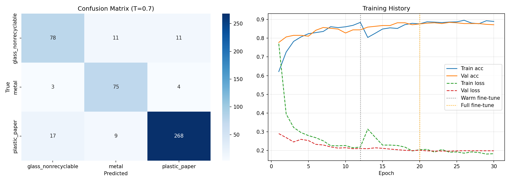
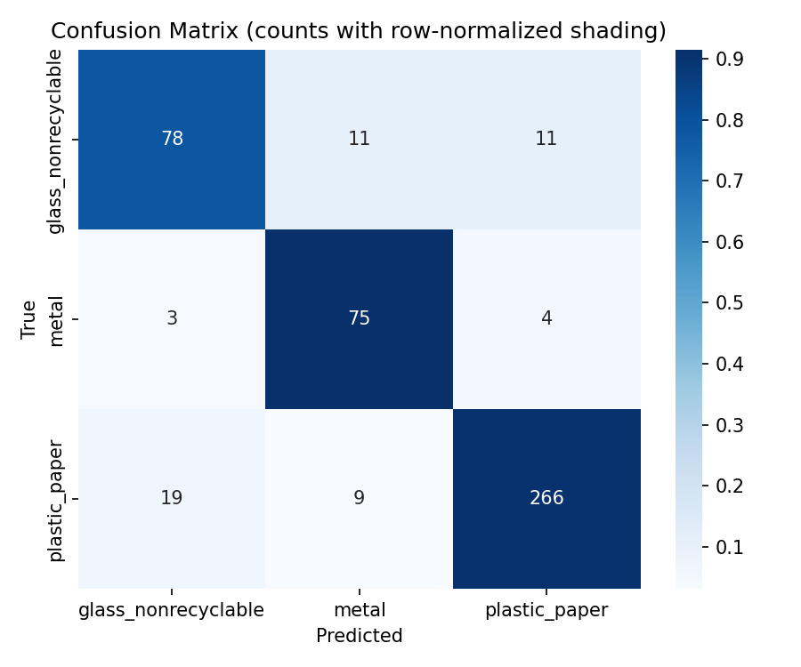
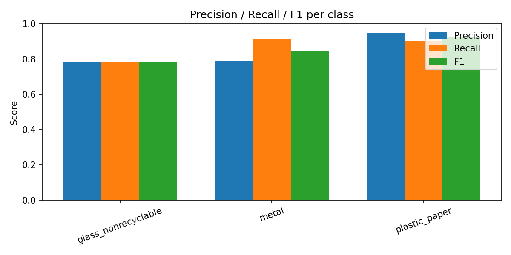

# Sortify

**A waste-image classifier for a smart bin.** Sortify takes a photo of a single piece of trash and decides which bin it belongs in, then only acts when it is confident enough to be trusted by a physical actuator.

It is built on MobileNetV2 transfer learning, trained on the Kaggle garbage-classification dataset, and exported to a quantized TFLite model small enough to run on edge hardware.

<p align="left">
  
  
  
  
  
</p>

---

## Why this is not just "another image classifier"

A real sorting bin cannot afford a confident wrong answer. A misclassified item drops into the wrong stream and contaminates the whole batch. Sortify is built around that constraint:

- **The label space is collapsed to what actually drives a motor.** The raw dataset has 6 classes; Sortify remaps them into 3 bins that map to physical outcomes.
- **The model is allowed to say "I am not sure."** Predictions pass a confidence threshold and a top-2 margin check before they are accepted. Low-confidence or ambiguous frames are abstained on instead of forced.
- **Probabilities are calibrated.** Temperature scaling is fit on the validation set so that a reported 0.8 confidence behaves like 0.8, which is what makes a threshold meaningful.
- **A single frame is not trusted blindly.** A recapture loop and a majority-vote actuator decision turn several noisy reads into one stable command.

---

## Label mapping

The raw Kaggle classes are remapped into three actionable bins:

| Raw class | Sortify bin |
|-----------|-------------|
| glass | `glass_nonrecyclable` |
| metal | `metal` |
| cardboard, paper, plastic | `plastic_paper` |
| trash | (dropped) |

This reflects how the downstream sorter physically separates streams, not how a textbook taxonomy would.

---

## Results

Evaluated on 476 held-out validation images.

| Bin | Precision | Recall | F1 | Support |
|-----|-----------|--------|----|---------|
| `glass_nonrecyclable` | 0.780 | 0.780 | 0.780 | 100 |
| `metal` | 0.790 | 0.915 | 0.847 | 82 |
| `plastic_paper` | 0.947 | 0.905 | 0.925 | 294 |
| **Accuracy** | | | **0.880** | 476 |
| **Macro avg** | 0.839 | 0.867 | 0.851 | 476 |
| **Weighted avg** | 0.884 | 0.880 | 0.881 | 476 |

<p align="left">
  
  
</p>
<p align="left">
  
</p>

---

## How it works

### Model
- **Backbone:** MobileNetV2 (ImageNet weights), 224x224 input. An EfficientNetV2B0 backbone is selectable via `SMARTBIN_BACKBONE` and falls back to MobileNetV2 if unavailable.
- **Head:** GlobalAveragePooling, BatchNorm, Dense(256) and Dense(64) with L2 regularization and dropout, softmax over 3 bins.

### Training (3 phases)
1. **Frozen backbone:** train only the head (12 epochs, lr 1e-3).
2. **Warm fine-tune:** unfreeze the last 40 layers (8 epochs, lr 2e-5).
3. **Full fine-tune:** unfreeze from layer 100 onward (up to 25 epochs, lr 5e-6).

Throughout: **class-weighted focal loss** (gamma 2.0) to handle the imbalance toward `plastic_paper`, **mixup** (alpha 0.2), and an augmentation stack of light/heavy transforms plus cutout. Callbacks: checkpoint on val accuracy, early stopping, and LR reduction on plateau.

### Calibration and decision logic
- **Temperature scaling** fit on validation, saved to `temperature.npy`.
- **Acceptance gate:** a prediction is accepted only if it clears the confidence threshold and the top-2 margin; otherwise it abstains.
- **Recapture + actuator vote:** multiple captures are aggregated into a single majority-vote command with a minimum-confidence floor.

### Deployment
- Exported to **`smartbin_cnn_quant.tflite`** (~3 MB) for edge inference.

---

## Project layout

```
Sortify/
├── train_model.py            # download, remap, 3-phase training, calibration, TFLite export
├── test_model.py             # inference: single image, folder, webcam, val set, with TTA + overlays
├── requirements.txt
├── run_gpu_train.sh          # GPU training entrypoint (CUDA/cuDNN env setup)
└── smartbin_project/
    ├── dataset_raw/          # 6 raw Kaggle classes  (gitignored, auto-downloaded)
    ├── dataset/              # remapped train/val splits (gitignored, generated)
    └── output/
        ├── smartbin_cnn_final.h5
        ├── smartbin_cnn_quant.tflite
        ├── model_config.json
        ├── temperature.npy
        └── *.png             # training + evaluation reports
```

---

## Getting started

### 1. Install
```bash
pip install -r requirements.txt
```

### 2. Get the data
Training auto-downloads from Kaggle if you have a `~/.kaggle/kaggle.json` token. Otherwise grab the [garbage-classification dataset](https://www.kaggle.com/datasets/asdasdasasdas/garbage-classification) manually and unzip it into `smartbin_project/dataset_raw/`.

### 3. Train
```bash
python train_model.py
# or, with GPU env wired up:
bash run_gpu_train.sh
# optional: pick a backbone
SMARTBIN_BACKBONE=efficientnetv2b0 python train_model.py
```

### 4. Run inference
```bash
# single image
python test_model.py --image path/to/item.jpg

# a folder of images
python test_model.py --folder path/to/images/

# live webcam
python test_model.py --webcam

# evaluate the full validation set
python test_model.py --val
```

Useful flags: `--threshold` (confidence cutoff), `--margin` (top-2 margin), `--tta` / `--no-tta` (test-time augmentation), `--recaptures`, `--show` (overlay window).

---

## Tech stack

TensorFlow / Keras, OpenCV, scikit-learn, NumPy, matplotlib, seaborn.

---

## Roadmap

- [ ] Reintroduce a `trash` / non-waste reject class for out-of-distribution items
- [ ] On-device benchmark of the TFLite model on a Raspberry Pi / microcontroller
- [ ] Active-learning loop to fold abstained captures back into training
